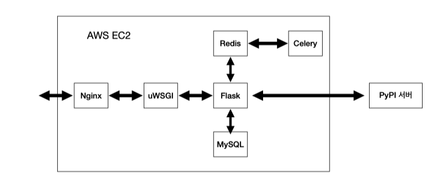

### 소개
* 본인의 PC 또는 가상환경에 설치된 파이썬 패키지의 최신 버전 정보를 확인해주는 웹 어플리케이션
  * requirements.txt 파일을 업로드하면 해당 내용과 redis에 저장된 캐시 데이터를 비교/분석하여 메일로 패키지 리포트를 발송
  * redis의 캐시는 celery beat를 통해 6시간 단위로 갱신되며, 회원가입 시 캐시 갱신을 실행 가능
  * 이 프로젝트의 실제 결과물 및 동일한 기능의 CLI 프로젝트는 아래 링크에서 확인할 수 있습니다.
    * [www.updatetracker.site](www.updatetracker.site)
    * [PyPI 저장소 주소](https://pypi.org/project/update-tracker/)

### 아키텍쳐
